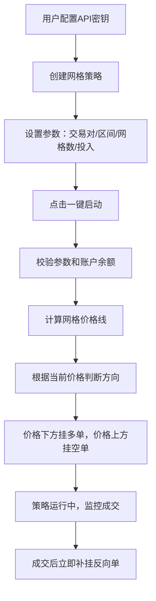
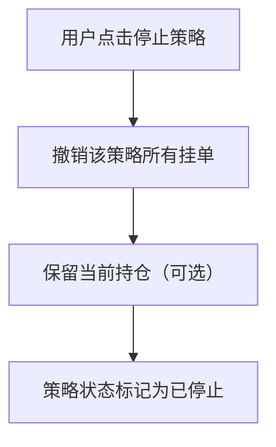

## 1. 产品概述

虚拟币网格交易系统 - 对接Binance交易所的自动化网格策略交易平台。用户可配置网格参数一键启动策略，系统自动在价格区间内挂单买卖，无需初始仓位，上涨做空、下跌做多，支持多策略并行运行。

- 核心目标：降低人工交易成本，通过网格策略在震荡行情中稳定获利
- 目标用户：数字货币投资者、量化交易爱好者

## 2. 核心功能

### 2.1 功能模块

1. **仪表盘首页**：总览资产、运行中的策略、收益概况
2. **策略管理**：创建/启动/停止网格策略、参数配置、策略列表
3. **持仓管理**：当前持仓展示、成本价、盈亏计算
4. **挂单管理**：当前挂单列表、订单状态、撤单操作
5. **API配置**：Binance API Key配置

### 2.2 页面详情

| 页面名称 | 模块名称 | 功能描述 |
|-----------|-------------|---------------------|
| 仪表盘 | 资产概览 | 显示总资产、可用余额、持仓市值、今日盈亏 |
| 仪表盘 | 运行策略 | 展示当前运行中的策略卡片，显示策略状态和收益 |
| 仪表盘 | 最近订单 | 最近成交的订单列表 |
| 策略管理 | 创建策略表单 | 交易对、价格上下限、网格数量、单格利润、总投入等参数配置 |
| 策略管理 | 策略列表 | 所有策略列表，支持启动/停止/删除操作 |
| 策略管理 | 策略详情 | 策略参数、网格分布图、当前挂单、历史成交 |
| 持仓管理 | 持仓列表 | 每个交易对的持仓量、成本价、当前价、浮动盈亏 |
| 挂单管理 | 挂单列表 | 所有未成交挂单，支持一键撤单和单独撤单 |
| API配置 | API密钥管理 | Binance API Key/Secret配置，测试连接 |

## 3. 核心流程

### 3.1 策略启动流程

### 3.2 策略停止流程

## 4. 用户界面设计

### 4.1 设计风格
- 主色调：深色金融科技风格，#0B0E11 背景色（Binance风格）
- 强调色：#F0B90B（金色，上涨）、#F6465D（红色，下跌）
- 按钮风格：圆角矩形，悬浮微放大效果
- 字体：现代无衬线字体，数字等宽显示
- 布局：左侧导航栏 + 右侧内容区，卡片式布局
- 图标：线性风格图标，配合颜色表达状态

### 4.2 页面设计概览

| 页面名称 | 模块名称 | UI元素 |
|-----------|-------------|-------------|
| 仪表盘 | 资产概览 | 大数字展示、渐变卡片、涨跌色标 |
| 仪表盘 | 运行策略 | 卡片列表、状态徽章、进度条 |
| 策略管理 | 创建表单 | 分区表单、滑块输入、数值输入框、实时预览 |
| 策略管理 | 策略列表 | 数据表、状态标签、操作按钮组 |
| 策略管理 | 策略详情 | 网格可视化图表、参数卡片、订单表格 |
| 持仓管理 | 持仓列表 | 数据表、盈亏进度条、色标高亮 |
| 挂单管理 | 挂单列表 | 数据表、撤单按钮、批量操作 |

### 4.3 响应式
- 桌面端优先（min-width: 1280px）
- 平板端（768px-1280px）：导航折叠为图标
- 移动端（<768px）：底部Tab导航，卡片单列布局
