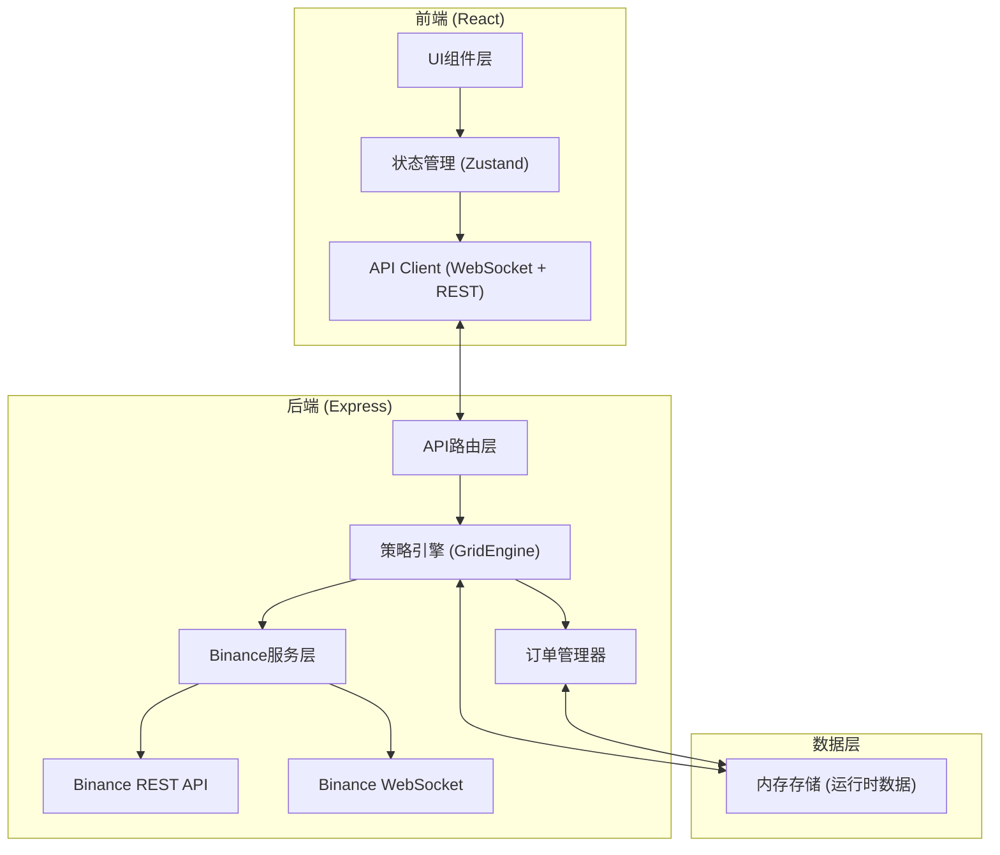
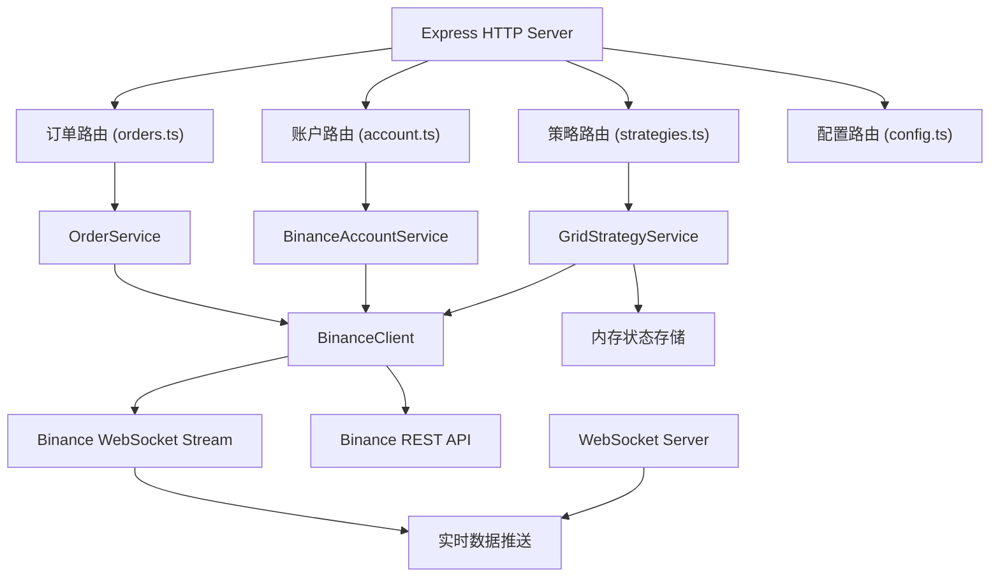

## 1. 架构设计



## 2. 技术描述

- 前端：React@18 + TypeScript + Vite + TailwindCSS@3 + Zustand + Recharts
- 后端：Express@4 + TypeScript + WebSocket
- 外部服务：Binance API（现货+合约）
- 数据存储：运行时内存存储（策略状态、订单、持仓）

## 3. 路由定义

| 路由 | 用途 |
|-------|---------|
| / | 仪表盘首页 |
| /strategies | 策略管理列表 |
| /strategies/create | 创建新策略 |
| /strategies/:id | 策略详情 |
| /positions | 持仓管理 |
| /orders | 挂单管理 |
| /settings | API配置 |

## 4. API 定义

### 4.1 类型定义

```typescript
// 网格策略
interface GridStrategy {
  id: string;
  name: string;
  symbol: string;        // 交易对，如 BTCUSDT
  lowerPrice: number;    // 价格下限
  upperPrice: number;    // 价格上限
  gridNum: number;       // 网格数量
  investment: number;    // 总投入金额 (USDT)
  status: 'running' | 'stopped' | 'error';
  createdAt: number;
  profit: number;        // 累计收益
  grids: GridLevel[];    // 网格线
}

interface GridLevel {
  index: number;
  price: number;
  buyOrderId?: string;
  sellOrderId?: string;
  buyFilled: boolean;
  sellFilled: boolean;
}

// 持仓
interface Position {
  symbol: string;
  amount: number;        // 持仓数量
  avgPrice: number;      // 平均成本
  currentPrice: number;
  unrealizedPnl: number; // 浮动盈亏
  unrealizedPnlPercent: number;
}

// 订单
interface Order {
  orderId: string;
  strategyId: string;
  symbol: string;
  side: 'BUY' | 'SELL';
  price: number;
  amount: number;
  status: 'NEW' | 'PARTIALLY_FILLED' | 'FILLED' | 'CANCELED';
  type: 'LIMIT';
  createdAt: number;
}

// API配置
interface ApiConfig {
  apiKey: string;
  apiSecret: string;
  testnet: boolean;      // 是否使用测试网
}
```

### 4.2 REST API 端点

| 方法 | 路径 | 功能 | 请求体 | 返回 |
|------|------|------|--------|------|
| GET | /api/config | 获取API配置 | - | ApiConfig |
| POST | /api/config | 保存API配置 | ApiConfig | {success: boolean} |
| POST | /api/config/test | 测试API连接 | ApiConfig | {success: boolean, balances?: any[]} |
| GET | /api/strategies | 获取所有策略 | - | GridStrategy[] |
| GET | /api/strategies/:id | 获取策略详情 | - | GridStrategy |
| POST | /api/strategies | 创建策略 | CreateStrategyRequest | GridStrategy |
| POST | /api/strategies/:id/start | 启动策略 | - | {success: boolean} |
| POST | /api/strategies/:id/stop | 停止策略 | - | {success: boolean} |
| DELETE | /api/strategies/:id | 删除策略 | - | {success: boolean} |
| GET | /api/positions | 获取持仓 | - | Position[] |
| GET | /api/orders | 获取挂单 | - | Order[] |
| DELETE | /api/orders/:id | 撤销订单 | - | {success: boolean} |
| DELETE | /api/orders | 撤销所有挂单 | - | {success: boolean} |
| GET | /api/account | 获取账户余额 | - | {balances: any[]} |
| GET | /api/ticker/:symbol | 获取实时价格 | - | {price: number} |

### 4.3 WebSocket 推送

后端通过WebSocket推送实时更新：
- `ticker`: 价格更新 `{symbol, price}`
- `orderUpdate`: 订单状态变更
- `strategyUpdate`: 策略状态变更
- `positionUpdate`: 持仓更新

## 5. 服务器架构



## 6. 核心模块设计

### 6.1 网格策略引擎 (GridEngine)

核心逻辑：
1. 初始化时根据价格区间和网格数量计算每个网格的价格线
2. 启动时：当前价格以下挂买单，当前价格以上挂卖单
3. 监听成交事件：买单成交后立即在上方网格挂卖单；卖单成交后立即在下方网格挂买单
4. 支持同时运行多个独立策略实例

### 6.2 Binance 服务层

封装Binance API调用：
- 账户余额查询
- 下单/撤单
- 订单查询
- WebSocket行情订阅
- 用户数据流订阅（订单更新、余额更新）
